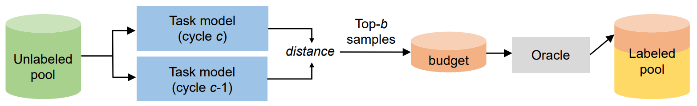
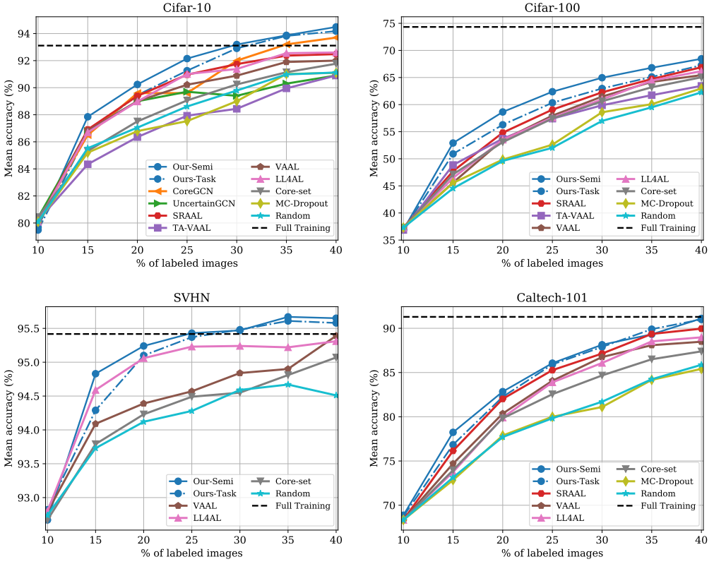

# Temporal Output Discrepancy for Active Learning
 PyTorch implementation of Semi-Supervised Active Learning with Temporal Output Discrepancy, *ICCV 2021*.

## Introduction
 * We present a loss measurement **Temporal Output Discrepancy (TOD)** which estimates the loss of unlabeled samples by evaluating the distance of model outputs at different SGD steps. 
 * We theoretically demonstrate that *TOD is a lower-bound of accumulated sample loss*. 
 * An unlabeled data sampling strategy and a semi-supervised training scheme are developed for active learning based on TOD. 

### TOD Active Data Selection

<p align="center">

</p>

### Results

<p align="center">

</p>

## Requirements

 numpy
 
 torch >= 1.0.1
 
 torchvision >= 0.2.1

## Data Preparation
 Download image classification datasets (e.g., Cifar-10, Cifar-100, SVHN, or Caltech101) and put them under `./data`.
 
 If you would like to try Caltech101 dataset, please download the pretrained [ResNet-18](https://download.pytorch.org/models/resnet18-5c106cde.pth) model and put it under `./`. 
 
 Directory structure should be like:
 ```
 TOD
 |-- data
     |-- 101_ObjectCategories
         |-- accordion
         |-- airplanes
         |-- anchor
         |-- ...
     |-- cifar-10-batches-py
     |-- cifar-100-python
     |-- svhn
         |-- train_32x32.mat
         |-- test_32x32.mat
 |-- resnet18-5c106cde.pth
 |-- ...
 ```
 

## Quick Start
 Run TOD active learning experiment on Cifar-10:
 ```
 bash run.sh
 ```
 
## Specify Datasets, Active Sampling Strategies, and Auxiliary Losses
 The dataset configurations, active learning settings (trials and cycles), and neural network training settings can be found in `./config` folder. 
 
 We provide implementations of active data sampling strategies including *random sampling*, *learning loss for active learning ([LL4AL](https://arxiv.org/abs/1905.03677))*, and our *TOD sampling*. Use `--sampling` to specify a sampling strategy.
 
 We also provide implementations of auxiliary training losses including *[LL4AL](https://arxiv.org/abs/1905.03677)* and our *COD loss*. Use `--auxiliary` to specify an auxiliary loss.
 
 ### Examples
 
 Cifar-100 dataset, TOD sampling, no unsupervised loss:
 ```
 python main_TOD.py --config cifar100 --sampling TOD --auxiliary NONE
 ```
 
 Caltech101 dataset, random sampling, COD loss:
  ```
 python main_TOD.py --config caltech101 --sampling RANDOM --auxiliary TOD
 ```
 
 SVHN dataset, LL4AL sampling, LL4AL loss:
 ```
 python main_LL4AL.py --config svhn --sampling LL4AL --auxiliary LL4AL
 ```

## Citation
```
 @inproceedings{huang2021semi,
  title={Semi-Supervised Active Learning with Temporal Output Discrepancy},
  author={Huang, Siyu and Wang, Tainyang and Xiong, Haoyi and Huan, Jun and Dou, Dejing},
  booktitle={Proceedings of the IEEE/CVF International Conference on Computer Vision (ICCV)},
  year={2021}
 }
```

## Contact
 [Siyu Huang](https://siyuhuang.github.io/)
 
 <huangsiyutc@gmail.com>
 
